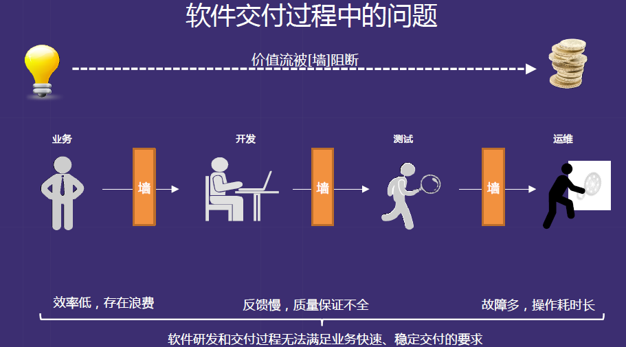
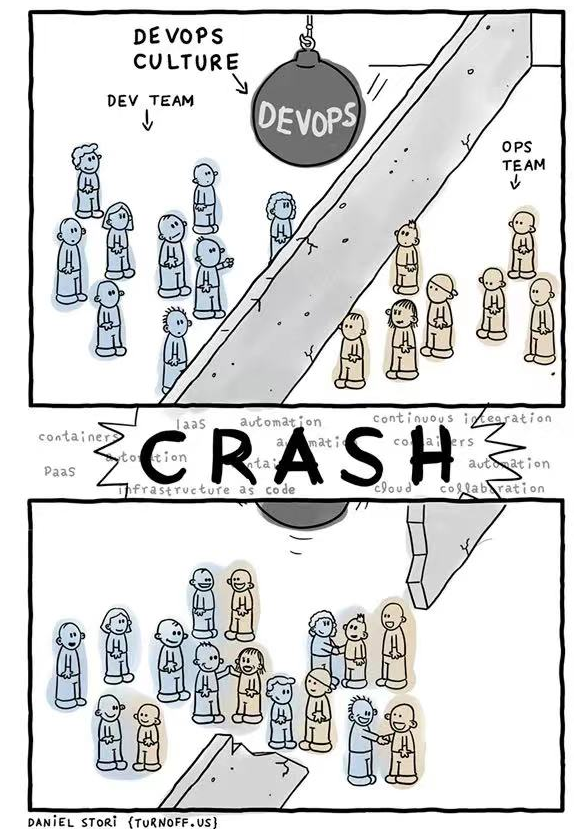
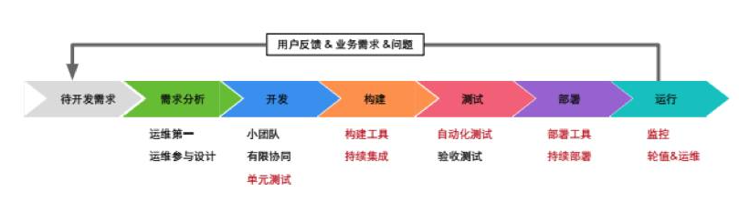
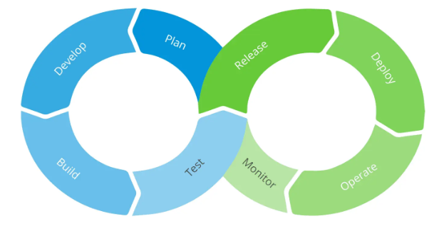
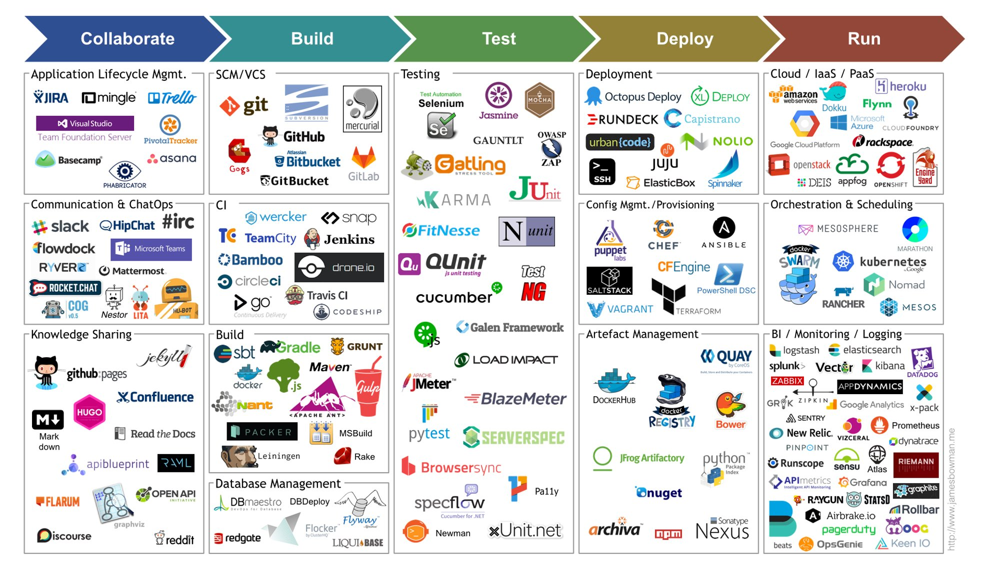

## DevOps 是什么以及理念

DevOps （Development Operations）是一种软件开发实践方法论，其核心思想是通过打破传统软件开发中开发团队（Development）与运维团队（Operations）之间的部门墙，促进开发团队与运维团队之间的协作与沟通，实现软件交付流程的持续优化和创新加速。

DevOps 的核心理念在于打破传统的职能壁垒，建立跨功能团队之间的信任与理解。

在DevOps的实践中，软件交付被视为一个完整的端到端流程，而非相互割裂的独立环节。

这种协作模式的目标是通过自动化流程，使软件的构建、测试、发布过程更加快捷、频繁和可靠。

DevOps 不仅仅是一套技术工具，更是一种文化和思维方式的变革，它强调整个软件交付链条上的所有参与者——包括开发人员、测试人员、运维工程师乃至业务人员——都应该围绕共同的业务目标紧密合作。

DevOps 的产生源于软件行业对交付效率的持续追求。

在传统的瀑布式开发模式下，软件从需求分析到最终上线往往需要数月甚至更长时间，而且由于开发和运维的割裂，经常出现代码开发完成后难以部署、部署后频繁出现问题的困境。

DevOps 正是为了解决这些痛点而诞生的，它通过引入敏捷开发的理念，结合自动化工具和流程优化，实现了软件交付的持续性和可预测性。

## 没有DevOps时的问题

- **环境不一致**

开发、测试、生产环境配置差异大，导致本地能跑，线上报错的常见问题。还有环境创建和配置依赖人工操作，极易出错且难以复现。

- **程序开发问题**

代码写完就甩锅，不管后面运维问题了，开发只管写代码，运维只管部署，隔离太开。

- **运维问题**：

手动部署流程繁琐，一次部署可能需要数天时间。上线靠手工，容易出错。

发布周期长，一周 / 一月一次。变更回滚困难，故障恢复时间长达数小时甚至数天。

测试环节滞后，缺陷发现就晚，修复成本高，修复 bug 速度慢。缺乏持续集成/持续交付机制，发布频率低，发现问题风险变高。

- **组织协作问题**

开发与运维目标不一致：开发追求快速迭代，运维追求系统稳定。跨团队沟通成本高，信息传递失真，问题定位困难。

程序开发只管开发这一摊子事，更多是对程序开发的了解，对运维的事情不了解，也不关心。

本质问题：**产品交付链路太长、手动操作太多**

## DevOps 的价值

DevOps 实践为组织带来的价值是多维度的。

在传统的瀑布式开发模式下，开发团队和运维团队往往属于不同的组织部门，有着不同的目标、指标和激励机制。

开发团队通常关注新功能的开发、快付发布和交付速度，而运维团队则将系统稳定性放在首位，对变更持谨慎态度。这种目标冲突导致两个团队之间缺乏有效协作，形成了所谓的“墙壁障碍”（Wall of Confusion），严重影响了软件交付的效率和质量。

传统模式下的主要挑战包括：

- 发布周期过长导致无法满足快速变化的市场需求；

- 部署过程高度依赖人工操作，效率低下且容易出错；

- 生产环境的故障定位和修复耗时较长；

- 软件质量问题往往要到生产环境才能被发现，修复成本极高。

DevOps通过引入自动化构建、测试和部署，结合持续反馈机制，系统性地来解决这些问题。

- 从交付速度角度来看，

DevOps 显著缩短了从代码提交到生产部署的周期时间。传统模式下可能需要数周甚至数月的发布周期，在成熟的 DevOps 实践中可以缩短到数小时甚至数分钟，这使得企业能够更快地响应市场需求和客户反馈。

- 从质量角度来看，

DevOps 通过将测试和监控嵌入到交付流水线的每个环节，实现了问题的早发现、早解决，有效降低了生产环境中缺陷的发生率。

- 从组织效率角度来看，

DevOps 打破了部门之间的信息孤岛，减少了因沟通不畅导致的返工和等待时间。

开发人员不再需要等待运维团队手动部署，而是可以通过自动化流水线自主完成从代码提交到上线的全流程。

运维团队也从繁琐的手工操作中解放出来，能够将更多精力投入到架构优化和稳定性保障工作中。

此外，DevOps 还带来了更高的团队满意度和员工敬业度，因为团队成员能够更清晰地看到自己工作的成果，形成正向的反馈循环。

## DevOps 实施需要做什么

实施 DevOps 需要系统性地规划和推进多项工作，这些工作可以归纳为以下几个核心领域：

**文化与组织变革**：

DevOps 成功的首要因素是文化层面的转变。

组织需要建立共享责任的文化，让开发团队和运维团队共同为系统的稳定性和交付效率负责。这包括建立跨功能团队、推行仆人式领导、鼓励持续学习和改进。企业需要打破传统的“开发完成后交给运维”的线性思维，建立起从需求提出到生产运维全流程的协作机制。

**流程、步骤与标准化**：

软件开发与运营的全生命周期

DevOps 有哪些步骤，

需要梳理和优化现有的软件交付流程，建立标准化的变更管理、发布管理和问题响应流程。

这些流程应该足够轻量以支持快速迭代，同时又要足够严谨以确保质量和合规性要求。流程优化是一个持续改进的过程，需要根据实际运行中遇到的问题不断调整和优化。

**技术基础设施建设**：

DevOps 的落地离不开完善的技术基础设施支撑。这包括版本控制系统的搭建与规范、持续集成/持续部署（CI/CD）流水线的建设、自动化测试体系的完善、配置管理与基础设施即代码（IaC）的实施、以及监控和日志平台的构建。每一项技术基础设施的建设都需要投入大量的时间和精力进行规划、实施和优化。

**工具链建设与集成**：

选择合适的工具链并确保工具之间的无缝集成是 DevOps 实施的关键环节。

工具链应该覆盖代码管理、构建自动化、测试自动化、部署自动化、配置管理、监控告警等全流程。

工具的选择需要综合考虑团队技术栈、项目需求、成本预算、供应商支持等多方面因素。

**度量与持续改进**：

建立完善的度量体系是 DevOps 持续改进的基础。需要定义和跟踪交付周期时间、部署频率、变更失败率、平均恢复时间等关键指标。这些指标不仅用于评估当前的 DevOps 成熟度，更重要的是指导后续的改进方向和优先级。

## 参考

- https://learn.microsoft.com/zh-cn/devops/what-is-devops devops是什么
- https://www.mendix.com/zh-CN/%E6%96%B0%E9%97%BB/%E4%B8%BA%E4%BB%80%E4%B9%88%E4%BD%A0%E5%BA%94%E8%AF%A5%E4%B8%BA%E4%BD%A0%E7%9A%84%E7%BB%84%E7%BB%87%E8%80%83%E8%99%91-DevOps/  组织从 DevOps 中获益的 7 种方式
- https://www.cnblogs.com/hofmann/p/9259968.html  百度王一男： DevOps 的前提是拆掉业务-开发-测试-运维中间的三面墙
- https://juejin.cn/post/6844903761391910926 打造易于落地的DevOps工具链