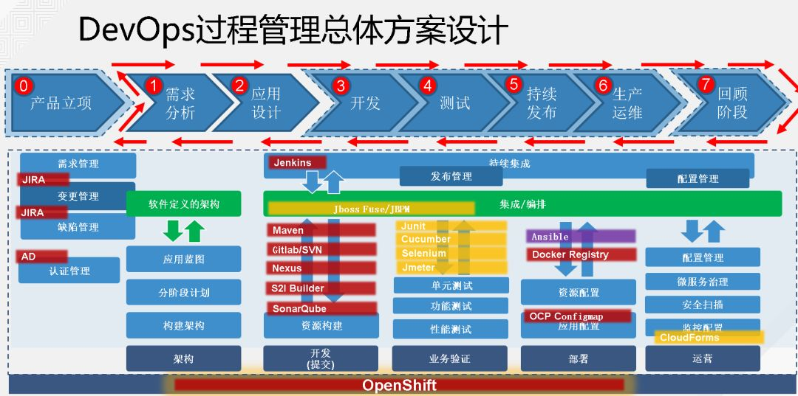

## **实施前的准备工作**

### 实施前准备

在正式实施DevOps之前，组织需要进行充分的准备工作，包括现状评估、目标设定和路线图规划三个主要环节。

现状评估的目的是全面了解组织当前在软件开发、测试、部署和运维方面的实际状况，识别出组织在 DevOps 成熟度上的当前位置，发现当前流程中的痛点和瓶颈。

目标设定是实施 DevOps 的关键步骤，需要根据组织的业务战略、技术现状和组织能力，制定清晰、可衡量的 DevOps 实施目标，这些目标应该涵盖交付效率、质量指标、运维稳定性和团队协作等多个维度。

路线图规划是将目标转化为具体行动的过程，将 DevOps 实施分解为多个阶段性目标，每个阶段聚焦于特定的改进领域，常见的做法是将DevOps 实施分为基础能力建设、核心流程优化和高级能力演进三个主要阶段。

### **实施的原则**

持续改进原则是 DevOps 的灵魂，要求组织建立持续反馈和优化的机制，不断审视和改进流程、技术和文化等各方面。

以终为始的原则要求团队始终关注业务价值的交付，而非单纯的技术实现，所有技术决策都应该以能否为客户和业务创造价值为衡量标准。

打破孤岛的原则强调跨功能协作的重要性，要求建立以产品或服务为中心的跨功能团队。

自动化优先是 DevOps 实施的基本策略，任何重复性的人工操作都应该被视为自动化的候选目标，自动化不仅可以提高效率，还能减少人为错误，提高一致性和可重复性。

### 红帽DevOps过程管理总方案

(红帽DevOps过程管理总方案)

## 实施详细步骤

### 第一阶段：基础设施与工具链建设

**版本控制系统建设**

版本控制系统是 DevOps 工具链的基础组件，所有代码、配置和文档的变更都应该通过版本控制系统进行管理。Git 是目前最主流的分布式版本控制系统，Gitea/Gitlab/Github 作为开源的 Git 服务解决方案，提供了与 GitHub 类似的功能体验，支持私有化部署，适合对数据安全有较高要求的组织。版本控制策略的制定是基础设施建设的关键环节，团队需要确定分支模型、提交规范和代码评审流程等核心要素。

常见的分支模型包括 GitFlow 适用于有明确发布周期和大量维护工作的项目，Trunk-Based Development 则更适合追求快速迭代的团队。

代码评审是版本控制流程中的重要环节，通过同行评审可以及早发现代码中的缺陷和设计问题，提高代码质量，同时促进团队成员之间的知识共享。

> 这里实施没选 gitlab，选了一个开源轻便的软件 Gitea。

**持续集成与发布环境搭建**

持续集成环境的搭建是实现高效软件交付的基础。

一个完善的持续集成环境应该能够自动接收代码变更触发构建，执行编译、测试等验证活动，并及时向团队反馈构建结果。

Gitea Actions提供了与 GitHub Actions类似的 CI/CD 功能，支持使用 YAML 配置文件定义构建流程。

典型的构建流程包括代码检出、依赖安装、代码编译、静态分析、单元测试、构建产物生成和发布等步骤，每个步骤的失败都应该及时终止流程并通知相关人员。

构建环境的一致性是持续集成的重要保障，通过使用容器化技术来标准化构建环境，可以确保构建过程在不同环境下的一致性。

**测试自动化体系建设**

测试自动化是 DevOps 实施的核心支柱之一，它确保了软件质量不会因为交付速度的提升而下降。

测试自动化体系通常包括单元测试、集成测试、端到端测试和性能测试等多个层次。

单元测试是对软件最小可测试单元的验证，通常由开发人员编写，具有执行速度快、定位问题准确的特点。

集成测试验证多个组件之间的协作是否正常，端到端测试从用户角度验证整个系统的功能流程，性能测试评估系统在不同负载条件下的响应能力和稳定性。

测试策略的制定需要根据项目的特点进行定制化设计，并非所有项目都需要完整的测试金字塔结构，关键是根据项目的风险程度、变更频率和质量要求来选择合适的测试策略。

### 第二阶段：核心流程优化

**持续交付流程设计**

持续交付流程的设计需要覆盖从代码提交到生产部署的完整链路。

这个流程通常包括构建、测试、部署到预发布环境、审批、部署到生产环境等主要环节，每个环节都应该定义明确的进入条件和执行标准，确保只有满足质量要求的代码才能进入下一个环节。

环境管理是持续交付流程中的重要考量，典型的环境配置包括开发环境、测试环境、预发布环境和生产环境，不同环境的配置应该尽可能保持一致。

发布策略的选择直接影响系统的稳定性和用户体验，常见的发布策略包括蓝绿部署、金丝雀发布和滚动发布等。

- 蓝绿部署维护两套完全相同的生产环境，新版本验证通过后通过负载均衡切换流量；

- 金丝雀发布逐步将流量从旧版本迁移到新版本；

- 滚动发布则逐批替换旧版本实例为新版本实例。

**基础设施即代码**

基础设施即代码（Infrastructure as Code，简称IaC）是将基础设施配置和管理纳入版本控制的实践。通过IaC，服务器、网络、存储等基础设施的配置可以通过代码描述，并像应用代码一样进行版本管理、评审和部署。

这种方式带来了多重好处：

配置的变更历史可以追溯，变更过程可以回滚；配置的一致性得到保障；环境的新建和销毁变得快速和可重复。Terraform是目前最流行的跨平台IaC工具，支持多种云服务提供商和基础设施组件；

Ansible是另一种广泛使用的配置管理工具，采用幂等的任务执行模式，支持复杂的部署编排场景。

所有的基础设施变更都应该通过代码评审流程，由相关人员进行审核后方可应用，变更的执行应该记录在变更管理系统中便于审计追溯。

**监控与可观测性**

监控与可观测性是保障系统稳定性和快速问题定位的基础。

可观测性包括日志（Logs）、指标（Metrics）和追踪（Traces）三个主要维度，俗称“监控三支柱”。日志记录了系统的离散事件，是问题发生后进行根因分析的重要依据。

指标是对系统行为的量化测量，通常是时序数据，用于长期趋势分析和告警触发。追踪记录了请求在分布式系统中的完整调用路径，有助于理解系统组件之间的交互关系。

监控体系的建设需要从业务和技术两个层面进行规划，业务层面监控关注系统对业务目标的支持程度，技术层面监控则关注基础设施和应用的技术指标。

告警策略的设计直接影响运维效率和系统稳定性，有效的告警应该具备可操作性，告警阈值的设计需要平衡灵敏度和噪声之间的关系。

### 第三阶段：高级能力演进

**安全内建实践**

安全内建（DevSecOps）是将安全性融入DevOps全流程的理念，强调安全不是事后检查，而是贯穿设计、开发、测试、部署和运维各环节的持续活动。在传统模式下，安全检查通常在开发完成后进行，这种方式往往导致安全问题发现太晚，修复成本高昂。

DevSecOps 通过将安全检查自动化，使其成为持续集成和持续交付流程的有机组成部分。

SAST（静态应用安全测试）工具在不运行程序的情况下分析源代码，能够发现潜在的安全漏洞；DAST（动态应用安全测试）工具通过对运行中的应用程序进行黑盒测试，模拟攻击者的行为方式发现问题；软件成分分析（SCA）工具用于识别项目依赖中的已知漏洞。

安全合规性管理也是 DevSecOps 的重要维度，将合规性要求转化为可执行的检查规则，融入自动化流程，可以确保合规状态得到持续保持。

**知识管理与持续改进**

知识管理是 DevOps 文化的重要组成部分，旨在促进团队知识的高效积累和共享。

知识管理的内容包括技术文档、最佳实践、故障排除记录、培训材料等多个方面，这些知识应该以易于检索和更新的形式进行组织。

故障复盘（Post-mortem）是持续改进的重要机制，当生产环境发生故障时，除了及时修复问题外，还应该进行结构化的故障复盘，分析问题的根本原因，制定预防措施。有效的故障复盘应该采取无责的态度，关注问题而非追究责任，以从事件中学习和改进为目标。

持续改进还需要建立有效的反馈循环，反馈可以来自多个渠道：

生产环境的监控指标反映系统的技术健康状况，用户反馈反映产品满足需求的程度，团队成员的日常工作反馈反映流程和工具的可用性。

## 各阶段标准流程详解

**代码开发标准流程**

代码开发标准流程是 DevOps 实践的起点，定义了从需求到代码提交的完整路径。

这个流程起始于需求分析阶段，产品经理和开发团队共同澄清需求细节，明确功能范围和验收标准。

进入开发阶段后，开发人员应该从主干创建功能分支，分支命名应该清晰反映其目的和关联的需求编号。

编码规范包括代码格式、命名约定、注释要求等内容，是保持代码一致性和可读性的基础。代码提交应该遵循原子性原则，即每次提交只包含一个逻辑上的变更，便于追踪和回滚。

功能开发完成后，通过 Pull Request 提交代码评审请求，评审者应该从功能正确性、设计合理性、性能影响、安全隐患、可读性等多个角度审查代码。

**构建验证标准流程**

构建验证流程在代码合并到主干后自动触发，是持续集成的重要环节。

构建流程首先检出最新代码，然后安装项目依赖，依赖清单应该纳入版本控制，而实际依赖包可以通过锁定文件来确保每次构建使用完全相同的依赖版本。

编译阶段将源代码转换为可执行形式，不同技术栈的编译过程有所不同。

测试阶段执行各类自动化测试，测试执行顺序通常按照反馈速度从快到慢排列：首先是快速的单元测试，然后是集成测试，最后是端到端测试。

构建产物生成阶段将编译产物和必要资源打包成可部署的格式，产物应该被打上版本标签，便于后续的追溯和回滚。

**部署发布标准流程**

部署发布流程是软件交付的关键环节，需要在效率和质量之间取得平衡。

部署前的准备工作包括确认发布内容、选择发布策略、准备回滚方案等，发布内容应该通过变更管理系统进行记录和审批。

- 预发布环境部署是生产部署前的最后验证环节，预发布环境应该尽可能模拟生产环境的配置。

生产环境部署的具体方式取决于所选择的发布策略，部署完成后应该立即执行健康检查确认应用正常运行。

如果发现问题，应该根据预设的回滚方案迅速回退到上一版本，待问题修复后再重新发布。

**运维响应标准流程**

运维响应流程涵盖生产环境的日常运维和异常事件处理。

事件分级是运维响应的基础，通常将事件分为紧急（Critical）、高（High）、中（Medium）和低（Low）四个等级。事件响应流程包括发现、确认、调查、解决和复盘五个阶段。

发现阶段可能通过监控告警、用户反馈或主动巡检等方式识别问题；确认阶段需要验证问题是否真实存在并评估其影响范围；调查阶段进行根因分析；解决阶段实施修复措施；复盘阶段对整个事件过程进行回顾总结。

变更管理是运维响应的另一个重要组成部分，任何对生产环境的变更都应该纳入变更管理流程。