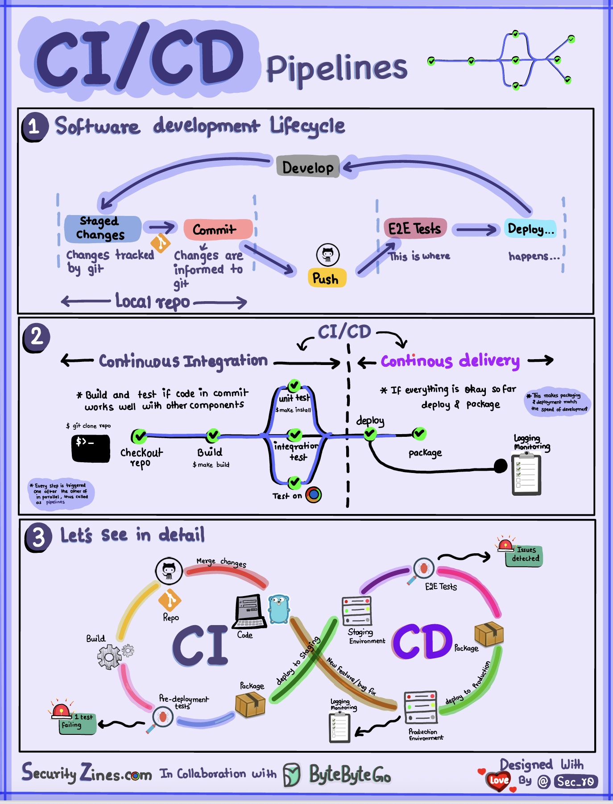

## CI/CD定义

CI/CD 是持续集成（Continuous Integration）与持续交付/持续部署（Continuous Delivery/Continuous Deployment）的统称，它代表了现代软件交付的核心实践体系。

持续集成是一种开发实践方法，它倡导开发团队成员更频繁地将代码集成到共享仓库中，每次集成都通过自动化构建（包括编译、构建和自动化测试）来验证，从而尽快发现集成错误，让正在开发的软件始终处于可工作状态。

持续交付则是持续集成的延伸，它将集成后的代码自动部署到类生产环境，确保可以持续的方式快速向客户交付新的功能和改进。

持续集成和持续交付虽然密切相关，但它们解决的是不同层面的问题。

持续集成主要关注代码质量和开发效率，通过自动化构建和测试确保每次代码变更都不会破坏现有功能；

持续交付则关注交付效率，通过自动化部署流程确保代码变更能够快速、可靠地到达各个环境。从技术实现角度来看，持续交付意味着每次代码通过所有测试后，系统就具备了随时部署到生产环境的能力；

而持续部署则更进一步，意味着代码变更在通过所有测试后会自动部署到生产环境，无需人工干预。

## CI/CD 解决的问题

CI/CD 的实施旨在解决软件交付过程中的多个核心痛点。

在传统的手工交付模式下，代码集成工作往往被推迟到项目末期，这导致集成问题在很长一段时间内被掩盖，当最终发现这些问题时，修复成本已经非常高昂。

此外，手工部署过程容易出错，不同环境的配置差异可能导致应用在不同环境中表现不一致，而回滚操作往往耗时且风险较高。这些问题不仅延长了交付周期，还严重影响了软件质量和团队效率。

CI/CD 通过自动化手段从根本上解决了这些问题。

- 通过持续集成，代码在每次提交时就会被自动构建和测试，集成问题能够在第一时间被发现和修复，这大大降低了缺陷的修复成本。

- 通过标准化的自动化流水线，不同环境的部署使用相同的流程和配置，有效消除了环境差异带来的问题。

- 再次，自动化部署显著提高了部署的频率和可靠性，使得小步快跑的增量发布成为可能，降低了单次发布的风险。

- 最后，CI/CD 流水线提供了完整的审计追踪，每次变更的内容、时间和执行者都有详细记录，这对于合规审计和问题追溯都非常有价值。

## CI/CD 流水线的核心组成

### CI/CD Pipeline 总图

(来自 bytebytego.com)

### CI/CD Pipeline流水线介绍

一个完整的 CI/CD 流水线通常包含以下几个核心阶段，每个阶段都承担着特定的质量保障或交付任务：

**代码提交与触发阶段**：

这是流水线的起点，当开发者将代码推送到版本控制系统时，流水线自动被触发。现代 CI/CD 系统通常支持多种触发条件，包括代码推送、标签创建、Pull Request 创建、定时触发以及手动触发等。

这个阶段的关键是确保触发条件的合理配置，既要保证重要变更能够及时触发构建，又要避免不必要的构建浪费资源。

**构建与编译阶段**：

此阶段负责将源代码编译成可执行的制品。构建过程可能包括依赖下载、代码编译、资源处理、版本号生成等步骤。对于不同类型的项目（Java、Maven、Gradle、npm、Go 等），构建工具和流程各有不同。

构建阶段的产物（Artifact）应该被妥善管理，便于后续阶段的使用和追溯。

**自动化测试阶段**：

测试是 CI/CD 流水线中最关键的环节之一，它直接决定了交付质量的底线。测试通常按金字塔模型组织，包括单元测试、集成测试和端到端测试。

- 单元测试覆盖面广、执行速度快，应该作为测试的主体；

- 集成测试验证组件之间的协作；

- 端到端测试模拟真实用户场景，覆盖核心业务流程。

测试结果应该被详细记录和展示，帮助开发者快速定位问题。

**制品管理与版本控制阶段**：

通过测试的构建产物需要被存储和管理，以便后续的部署和追溯。现代 CI/CD 系统通常提供制品仓库功能，支持版本管理、访问控制、签名验证等安全特性。制品的版本命名应该有清晰的规则，便于追踪和回滚。

**部署阶段**：

部署阶段将构建产物安装到目标环境。根据环境的不同，部署流程可能包括配置更新、服务重启、健康检查、数据库迁移等操作。部署应该是幂等的，即多次执行相同部署应该产生相同的结果。蓝绿部署和金丝雀发布是常见的降低部署风险的策略。

**监控与反馈阶段**：

部署完成后的监控和反馈同样重要。通过收集应用的运行时指标、日志和用户体验数据，可以评估部署的效果，及时发现潜在问题。监控数据也为后续的优化和决策提供了数据支撑。