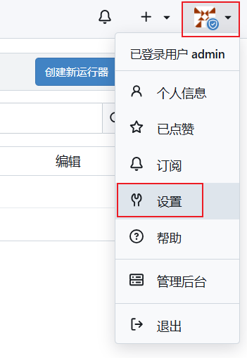
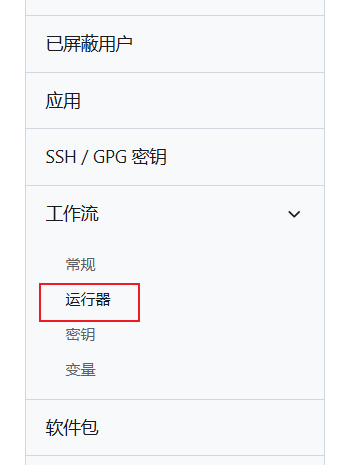
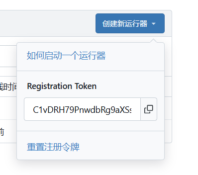
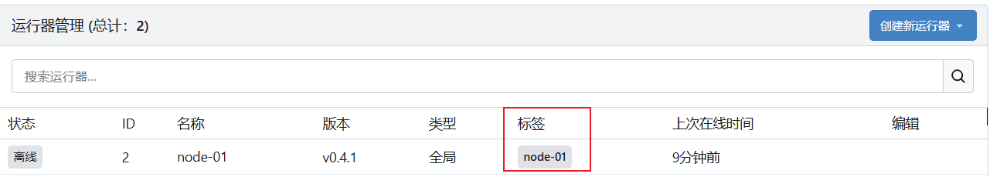
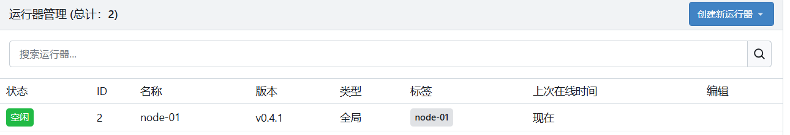
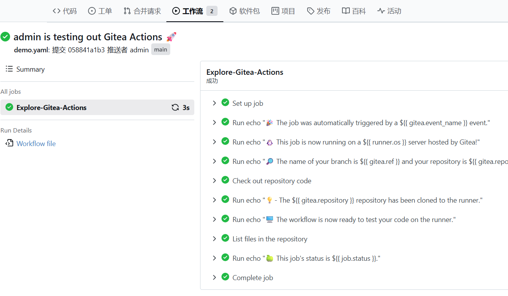
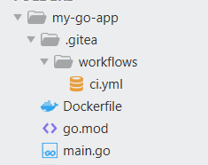
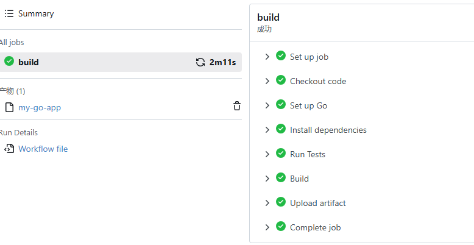

## Gitea 介绍

[Gitea](https://about.gitea.com/) 是一个开源的轻量级代码托管和协作开发平台，由 Gitea 社区开发和维护。它是用 Go 语言编写的自托管 Git 服务解决方案，设计理念是提供一个简单、易于部署和维护的代码托管平台。

Gitea 的界面简洁直观，功能丰富实用，特别适合中小型团队和个人开发者使用。作为一个完全开源的项目，Gitea 的源代码托管在GitHub上，接受全球开发者的贡献和审查，这确保了项目的透明度和持续改进。Gitea 的名称融合了"Git"和"Tea"的元素，象征着在轻松的氛围中进行代码协作的愿景。

> https://github.com/go-gitea/gitea

> docs.gitea.com

Gitea 的核心功能围绕 Git 代码托管展开，提供了代码仓库管理、代码浏览、问题追踪、Pull Request 协作等开发者日常工作中必备的功能。

与其他商业代码托管平台相比，Gitea 最大的特点在于其轻量级设计和私有化部署能力。用户可以在自己的服务器上部署 Gitea，完全掌控自己的代码和数据，无需依赖第三方服务。

这种部署模式对于有数据安全要求、合规要求或者希望降低成本的组织来说具有极大的吸引力。Gitea 的安装包非常小，资源占用低，即使是配置较低的服务器也能流畅运行，这使得它成为资源受限环境下的理想选择。

## Gitea 特性

https://docs.gitea.com/zh-cn/

- 首先是轻量级设计，Gitea 的二进制文件非常小，通常只有几十MB，内存占用低，数据库支持SQLite、MySQL、PostgreSQL等多种选择
- 易于部署，Gitea 提供了多种安装方式，包括二进制文件直接运行、Docker 容器部署、Kubernetes Helm Chart部署等
- 提供了仓库管理、代码浏览、问题追踪、Pull Request、Wiki、里程碑管理等协作开发所需的全套功能
- Gitea 还支持Git钩子（Hooks）功能，允许用户在特定Git操作时触发自定义脚本。
- Pull Request 功能支持在线代码评审，评审者可以在代码行上添加评论，讨论代码变更的细节
- Issue 追踪系统功能完善，支持创建问题、分配责任人、设置标签和里程碑、跟踪问题状态等操作
- 制品库: Gitea支持超过 20 种不同种类的公有或私有软件包管理，包括：Cargo, Chef, Composer, Conan, Conda, Container, Helm, Maven, npm, NuGet, Pub, PyPI, RubyGems, Vagrant等
- CI/CD: Gitea Actions ⽀持 CI/CD 功能，该功能兼容 GitHub Actions，⽤⼾可以采用熟悉的 YAML 格式编写 workflows，也可以重⽤⼤量的已有的 Actions 插件。Actions 插件支持从任意的 Git 网站中下载。
- 组织与团队管理：组织是顶层的组织单元，可以包含多个团队和仓库。团队是组织下的子单元，用于对成员进行分组和权限管理。一个组织可以创建多个团队，每个团队可以设置不同的访问权限

与其它 Git 托管工具对比文档：https://docs.gitea.com/zh-tw/installation/comparison

## Gitea CI/CD准备工作

### Gitea Actions简介

Gitea Actions 是 Gitea 1.19 版本引入的重磅功能，它为 Gitea 提供了原生的持续集成和持续部署能力。

在此之前，Gitea 用户通常需要集成第三方的 CI/CD 工具如 Jenkins、Drone 等来实现自动化构建和部署。Gitea Actions 的推出使得这一切变得更加简单，用户可以在同一个平台上完成代码托管和 CI/CD 的全部工作。

Gitea Actions 的设计借鉴了 GitHub Actions 的成功经验，采用了类似的工作流定义格式，这意味着熟悉 GitHub Actions 的用户可以轻松迁移到 Gitea 平台。

Gitea Actions的核心概念包括工作流（Workflow）、作业（Job）和步骤（Step）三个层次。工作流定义在YAML文件中，通常放置在仓库根目录的。

- 工作流（Workflow）通过触发器（Trigger）定义何时执行，可以响应推送、Pull Request创建、标签发布、定时任务或手动触发等事件。

- 作业（Job）是工作流中的独立任务单元，可以配置为并行或顺序执行。

- 步骤（Step）是作业中的具体操作步骤，可以是检出代码、安装依赖、运行命令或调用Action等

### Runner简介

和其他 CI/CD 解决方案一样，比如github，Gitea 不会自己运行 Job，而是将 Job 委托给 Runner。 Gitea Actions 的 Runner 被称为[act runner](https://gitea.com/gitea/act_runner)，它是一个独立的程序，也是用 Go 语言编写的。 它是基于 [nektos/act](http://github.com/nektos/act) 的一个[分支](https://gitea.com/gitea/act) 。

Gitea Actions Runner 是执行工作流任务的代理程序，它负责监听任务队列、执行具体步骤、上报执行结果等核心功能，完成具体的构建、测试或部署任务。

### docker安装gitea

创建一个目录 gitea-cicd，在 gitea-cicd 目录里创建  `docker-compose.yml` ，把下面内容粘贴进 docker-compose.yml 中

```bash
version: "3"

networks:
  gitea:
    external: false

services:
  server:
    image: docker.gitea.com/gitea:1.26.0
    container_name: gitea
    environment:
      - USER_UID=1000
      - USER_GID=1000
    restart: always
    networks:
      - gitea
    volumes:
      - ./gitea:/data
      - /etc/timezone:/etc/timezone:ro
      - /etc/localtime:/etc/localtime:ro
    ports:
      - "3000:3000"
      - "222:22"
```

基于 docker-compose.yml 启动，使用命令：`docker-compose up -d`，这个命令在后台启动 gitea。使用 `docker-compose ps` 命令查看 gitea 是否启动了。这个是运行gitea的服务器。

要关闭 gitea，执行 `docker-compose down`。这将停止并杀死容器。这些卷将仍然存在。

> 还可以把 gitea runner 也放进上面的 docker-compose.yml 中，一起启用，参看文档

安装完成，启动了gitea后，在web上访问：

- http://你的IP:3000，

完成初始化：

- 数据库：SQLite（简单用）
- 管理员账号：填写管理员账号、密码等信息

**启动 Actions**：

- 从1.21.0开始，默认情况下，Actions是启用的
- 在使用1.21.0之前的版本，您需要将以下内容添加到配置文件中以启用它：

> [actions]
> ENABLED=true

### Runner 安装

我是用二进制安装和使用 act_runner，到这个页面下载对应操作系统 act_runner ，https://gitea.com/gitea/act_runner/releases 。

在 Ubuntu 下下载act_runner：

```bash
sudo curl -L -o act_runner https://gitea.com/gitea/act_runner/releases/download/v0.4.1/act_runner-0.4.1-
linux-amd64
```

修改可执行权限：

```bash
sudo chmod a+x act_runner
```

**设置Runner，注册到gitea上**

在运行 Runner 之前，您需要使用以下命令将其注册到 Gitea 实例中：

```bash
./act_runner register --no-interactive --instance <instance> --token <token>
```

文档地址：https://docs.gitea.com/zh-cn/usage/actions/quickstart

- 需要两个必需的参数：`instance` 和 `token`。

`instance`是您的Gitea实例的地址，如`http://192.168.8.8:3000`或`https://gitea.com`。 Runner和Job容器（由Runner启动以执行Job）将连接到此地址。 这意味着它可能与用于Web访问的`ROOT_URL`不同。 使用回环地址（例如 `127.0.0.1` 或 `localhost`）是一个不好的选择。 如果不确定使用哪个地址，通常选择局域网地址即可。

```
token` 用于身份验证和标识，例如 `P2U1U0oB4XaRCi8azcngmPCLbRpUGapalhmddh23`。 它只能使用一次，并且不能用于注册多个Runner。 您可以从以下位置获取不同级别的`token`,从而创建出相应级别的`runner

- 实例级别：管理员设置页面，例如 `<your_gitea.com>/admin/actions/runners`。
- 组织级别：组织设置页面，例如 `<your_gitea.com>/<org>/settings/actions/runners`。
- 存储库级别：存储库设置页面，例如 `<your_gitea.com>/<owner>/<repo>/settings/actions/runners`。
```


**获取实例级别的token说明**

实例级别的 token 获取，登录进 gitea 后（我这里安装是gitea v1.26.0），点击右上角管理员图像，在点击设置菜单，







### 把runner注册到gitea上

注册到 gitea 上命令例子：

```bash
./act_runner register \
  --no-interactive \
  --instance http://127.0.0.1:3000 \
  --token wPeu9wd9pzQvKujSgeqRDoUWDRqr8aoIxOB7mkRS \
  --name node-01 \
  --labels ubuntu-latest
```

- --instance：访问 gitea 的地址，一般是局域网地址 192.168 ..:3000 ，我这里写回环地址，其实不建议这样做，为了方便
- --labels：这个再写 cicd 时可以用 labels 匹配到这个 runner，也就是说这个 CI 文件用这个runner来运行
- --name：这个 runner 的名称

> 注册成功显示信息：
>
> INFO Registering runner, arch=amd64, os=linux, version=v0.4.1.
> WARN Runner in user-mode.
> DEBU Successfully pinged the Gitea instance server
> INFO Runner registered successfully.


管理后台显示，注册完，运行后：



### 启动runner

最后，是时候启动Runner了：

```bash
./act_runner daemon
```

管理后台显示：



### 使用Actions，启用仓库工作流

即使对于启用了Gitea实例的Actions，存储库仍默认禁用Actions。

要启用它，请转到存储库的设置页面，例如`your_gitea.com/<owner>/repo/settings`，然后启用`Enable Repository Actions`。

### workflow语法

Github Actions的 workflow 语法

- https://docs.github.com/en/actions/reference/workflows-and-actions/workflow-syntax 

## gitea cicd 实战

### 最简单的CI

创建一个项目目录go-demo-actions，里面创建 .gitea/workflows 目录，在workflows目录创建文件 demo.yaml, 里面内容如下：

```yaml
name: Gitea Actions Demo
run-name: ${{ gitea.actor }} is testing out Gitea Actions 🚀
on: [push]

jobs:
  Explore-Gitea-Actions:
    runs-on: ubuntu-latest
    steps:
      - run: echo "🎉 The job was automatically triggered by a ${{ gitea.event_name }} event."
      - run: echo "🐧 This job is now running on a ${{ runner.os }} server hosted by Gitea!"
      - run: echo "🔎 The name of your branch is ${{ gitea.ref }} and your repository is ${{ gitea.repository }}."
      - name: Check out repository code
        uses: actions/checkout@v4
      - run: echo "💡- The ${{ gitea.repository }} repository has been cloned to the runner."
      - run: echo "🖥️ The workflow is now ready to test your code on the runner."
      - name: List files in the repository
        run: |
          ls ${{ gitea.workspace }}
      - run: echo "🍏 This job's status is ${{ job.status }}."
```

把这个git push 到gitea服务器上，然后就会自动运行，运行情况如下图：



### 最简单Go程序CI

Go 程序目录如下图：



main.go

```go
package main

import (
	"fmt"
	"net/http"
)

func main() {
	http.HandleFunc("/", func(w http.ResponseWriter, r *http.Request) {
		fmt.Fprintf(w, "Hello CI/CD")
	})

	// 健康检查端点
	http.HandleFunc("/health", func(w http.ResponseWriter, r *http.Request) {
		fmt.Fprintf(w, "Hello health")
	})

	http.ListenAndServe(":8080", nil)
}
```

go.mod

```go
module my-go-app

go 1.23.11
```

ci.yml

```yaml
name: Go CI/CD

on:
  push:
    branches: [ "main" ]
  pull_request:
    branches: [ "main" ]

jobs:
  build:
    runs-on: ubuntu-latest  # 使用已部署的 act_runner
    steps:
      - name: Checkout code
        uses: actions/checkout@v3

      - name: Set up Go
        uses: actions/setup-go@v4
        with:
          go-version: '1.23.11'

      - name: Install dependencies
        run: go mod download

      - name: Run Tests
        run: go test -v ./...

      - name: Build
        run: CGO_ENABLED=0 GOOS=linux GOARCH=amd64 go build -v -o my-app .

      # (可选) 将构建的二进制文件或Docker镜像推送到服务器，
      # 这里示例可以上传 artifacts 用于发布
      - name: Upload artifact
        uses: actions/upload-artifact@v3
        with:
          name: my-go-app
          path: my-app
```

然后用 git push 到gitea仓库里，runnetr 就会运行 ci.yml



### Go程序增加测试

还是上面的程序目录结构，

- main.go 代码

```go
package main

import (
	"fmt"
	"net/http"
	"os"
	"time"

	"github.com/gin-gonic/gin"
)

func main() {
	// 配置信息
	port := getEnv("PORT", "8080")
	env := getEnv("APP_ENV", "development")

	r := gin.Default()

	// 健康检查端点
	r.GET("/health", func(c *gin.Context) {
		c.JSON(http.StatusOK, gin.H{
			"status":    "healthy",
			"timestamp": time.Now().Format(time.RFC3339),
			"env":       env,
		})
	})

	// 主页面
	r.GET("/", func(c *gin.Context) {
		c.JSON(http.StatusOK, gin.H{
			"message":    "Hello from Gitea Actions!",
			"version":    "1.0.0",
			"framework":  "Gin",
			"env":        env,
			"hostname":   getHostname(),
			"timestamp":  time.Now().Format(time.RFC3339),
		})
	})

	// 版本信息
	r.GET("/version", func(c *gin.Context) {
		c.JSON(http.StatusOK, gin.H{
			"version":   "1.0.0",
			"buildTime": time.Now().Format(time.RFC3339),
			"gitCommit": getEnv("GIT_COMMIT", "unknown"),
		})
	})

	fmt.Printf("Server starting on port %s (env: %s)\n", port, env)
	if err := r.Run(":" + port); err != nil {
		fmt.Printf("Failed to start server: %v\n", err)
		os.Exit(1)
	}
}

func getEnv(key, defaultValue string) string {
	if value := os.Getenv(key); value != "" {
		return value
	}
	return defaultValue
}

func getHostname() string {
	if hostname, err := os.Hostname(); err == nil {
		return hostname
	}
	return "unknown"
}
```

- mian_test.go 代码

```go
package main

import (
	"net/http"
	"net/http/httptest"
	"testing"

	"github.com/gin-gonic/gin"
)

func TestMain(m *testing.M) {
	gin.SetMode(gin.TestMode)
	m.Run()
}

func TestHealthEndpoint(t *testing.T) {
	router := gin.New()
	router.GET("/health", func(c *gin.Context) {
		c.JSON(http.StatusOK, gin.H{"status": "healthy"})
	})

	req, _ := http.NewRequest("GET", "/health", nil)
	w := httptest.NewRecorder()
	router.ServeHTTP(w, req)

	if w.Code != http.StatusOK {
		t.Errorf("Expected status code %d, got %d", http.StatusOK, w.Code)
	}
}

func TestMainEndpoint(t *testing.T) {
	router := gin.New()
	router.GET("/", func(c *gin.Context) {
		c.JSON(http.StatusOK, gin.H{"message": "Hello from Gitea Actions!"})
	})

	req, _ := http.NewRequest("GET", "/", nil)
	w := httptest.NewRecorder()
	router.ServeHTTP(w, req)

	if w.Code != http.StatusOK {
		t.Errorf("Expected status code %d, got %d", http.StatusOK, w.Code)
	}
}
```

- go.mod 增加 require github.com/gin-gonic/gin v1.9.1

```go
module my-go-app

go 1.23.11


require github.com/gin-gonic/gin v1.9.1
```

- ci.yml

```yaml
name: Go CI/CD

on:
  push:
    branches: [ "main" ]
  pull_request:
    branches: [ "main" ]

jobs:
  build:
    runs-on: ubuntu-latest  # 使用已部署的 act_runner
    steps:
      - name: Checkout code
        uses: actions/checkout@v3
        env:
          HTTP_PROXY: http://127.0.0.1:10808
          HTTPS_PROXY: http://127.0.0.1:10808

      - name: Set up Go
        uses: actions/setup-go@v4
        with:
          go-version: '1.23.11'

      - name: Install dependencies
        env:
          GOPROXY: https://goproxy.cn,direct
          GO111MODULE: "on"
        run: go mod tidy

      - name: Run Tests
        run: go test -v ./...

      - name: Build
        run: CGO_ENABLED=0 GOOS=linux GOARCH=amd64 go build -v -o my-app .

      # (可选) 将构建的二进制文件或Docker镜像推送到服务器，
      # 这里示例可以上传 artifacts 用于发布
      - name: Upload artifact
        uses: actions/upload-artifact@v3
        with:
          name: my-go-app
          path: my-app
```

说明：

ci.yml 里面下载 actions/checkout ，是从github上下的，有时下载不下来就报错，所以增加一个代理。

还有Go的一些包下载，增加了代理 GOPROXY: https://goproxy.cn,direct。


把上面修改的 push 到 gitea 服务器上，然后runner就会运行 ci.yml 了。

## 其它：分支模型介绍

### main / dev / feature 分支模型

main      → 生产环境（稳定）
dev       → 集成环境（测试）
feature/* → 功能开发

**main 分支**

- 禁止直接 push 
- 必须 PR 合并 
- 必须 CI 通过 

**dev 分支**

- 允许开发合并
- 也建议走 PR

### GitFlow标准分支模型

分支结构：

```bash
main        → 生产环境（线上）
develop     → 开发主线（集成）
feature/*   → 功能开发
release/*   → 发布准备
hotfix/*    → 紧急修复
```

流转关系

```bash
feature → develop → release → main
                        ↑
                    hotfix
```

### 用go-shop例子说明gitflow

#### GoShop 实战：从 v0.5 → v0.6

当前状态

- main：v0.5（线上版本）
- 你要开发：v0.6

**Step 1：初始化 GitFlow**

------

```
git checkout main
git checkout -b develop
git push origin develop
```

------

👉 现在：

- main = 生产
- develop = 下一版本主线

**Step 2：开发功能（feature）**

示例：开发“订单系统”

```
git checkout develop
git checkout -b feature/order
```

------

开发完成后：

```
git add .
git commit -m "feat: order module"
git push origin feature/order
```

------

👉 在 Gitea 上：

- 创建 PR：feature/order → develop
- Code Review
- 合并

**Step 3：创建 release 分支（关键）**

------

👉 当 v0.6 功能完成：

```
git checkout develop
git checkout -b release/v0.6
git push origin release/v0.6
```

------

👉 release 分支作用：

- 做最终测试
- 修 bug
- 不再加新功能 ❗

**Step 4：发布上线（合并到 main）**

------

```
git checkout main
git merge release/v0.6
git push origin main
```

打 Tag（必须）

```
git tag v0.6
git push origin v0.6
```

**Step 5：回合并到 develop（很多人会忘）**

------

```
git checkout develop
git merge release/v0.6
git push origin develop
```

------

👉 目的：

避免 release 的修复丢失

**Step 6：删除 release 分支**

------

```
git branch -d release/v0.6
git push origin --delete release/v0.6
```


#### 紧急修复（hotfix 流程）

场景 - 线上 v0.6 出 bug

**Step 1：从 main 开 hotfix**

```
git checkout main
git checkout -b hotfix/v0.6.1
```

**Step 2：修复**

```
git commit -m "fix: payment bug"
```

**Step 3：合并回 main**

```
git checkout main
git merge hotfix/v0.6.1
git push origin main
```

**Step 4：打补丁版本**

```
git tag v0.6.1
git push origin v0.6.1
```

## 参考

- https://docs.gitea.com/zh-cn/ gitea docs文档
- http://github.com/nektos/act
- https://gitea.com/gitea/act_runner runner
- https://docs.gitea.com/zh-cn/installation/install-with-docker  gitea 的docker安装
- https://about.gitea.com/products/runner/  runner介绍
- https://docs.gitea.com/zh-cn/usage/actions/quickstart gitea action 介绍
- https://docs.gitea.com/zh-cn/usage/actions/act-runner  gitea act_runner 详细的安装、配置、注册、运行介绍
- https://docs.github.com/en/actions/get-started/quickstart gitea action 介绍
- https://docs.github.com/en/actions/reference/workflows-and-actions/workflow-syntax Actions的 workflow 语法